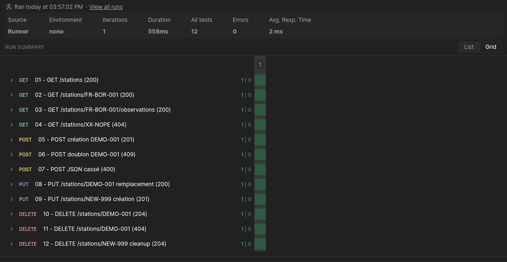
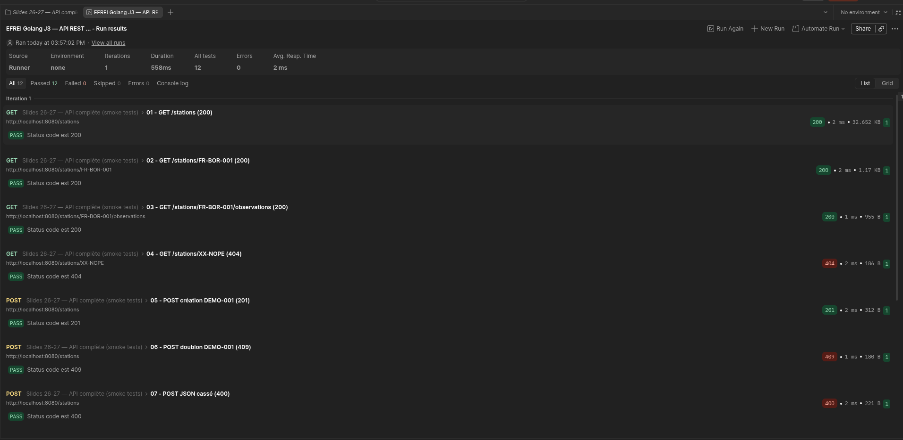
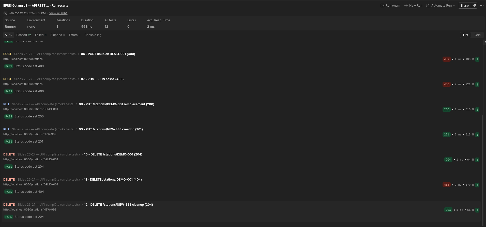

| Donnée               | Représentation en JSON                                                                                  | Représentation en XML                                              |
|----------------------|---------------------------------------------------------------------------------------------------------|--------------------------------------------------------------------|
| Pays                 | `"stations": [{"country": "France"}]`                                                                   | `<station id="FR-PAR-002" country="FR">`                           |
| Coordonnées          | `"stations": [{"location": { "latitude": 44.8333,"longitude": -0.7}}]`                                  | `<coordinates lat="45.7264" lon="4.9416" altitude="197"/>`         |
| Altitude             | `"stations": [{"altitude_m": 47}]`                                                                      | `<coordinates lat="47.15" lon="-1.6166" altitude="27"/>`           |
| Modèle de capteur    | `"stations": [{"device": {"type": "AWS-3000","manufacturer": "Vaisala","installed_on": "2015-12-09"}}]` | `<hardware vendor="Vaisala" model="AWS-3000" since="2015-12-09"/>` |
| Température          | `"stations": ["observations": [{"temperature_celsius": 3.3}]]`                                          | `<measure type="temperature" unit="C">-3.3</measure>`              |
| Conditions ciel      | `"stations": ["observations": [{"conditions": "fog"}]]`                                                 | `<observation at="2026-05-24T05:00:00Z" sky="fog">`                |
| Vent                 | `"stations": ["observations": [{"wind": {"speed_kmh": 56.5,"direction_deg": 81},}]]`                    | `<wind speed="34.6" direction="64"/>`                              |
| Notes (optionnelles) | `"stations": ["observations": [{"notes": null} ]]`                                                      | `<note>Pluviomètre nettoyé en début de mois</note>`                |


## Start the project :
To run the project you need to go in the folder and run the command : 
```shell
cd weather
go run .
```

Once it is done, you can run all the command of POSTMAN.

| Route                              | Method | Status Codes                          |
|------------------------------------|--------|---------------------------------------|
| `/stations`                        | GET    | `200 OK`                              |
| `/stations`                        | POST   | `201 Created`, `409 ID ALREADY TAKEN` |
| `/stations/{id}/observations`      | GET    | `200 OK`                              |
| `/stations/{id}`                   | PUT    | `200 OK`, `201 Created`               |
| `/stations/{id}`                   | DELETE | `204 No Content`, `404 NOT FOUND`     |
| `/stations/{id}`                   | GET    | `200 OK`                              |
| `/health`                          | GET    | `200 OK`                              |

To run the postman collection you need to download the EFREI Golang J3 — API REST météo
Then you just have to right click on Slides 26-27 — API complète (smoke tests) and run all the test.

Here are the results of the test :



